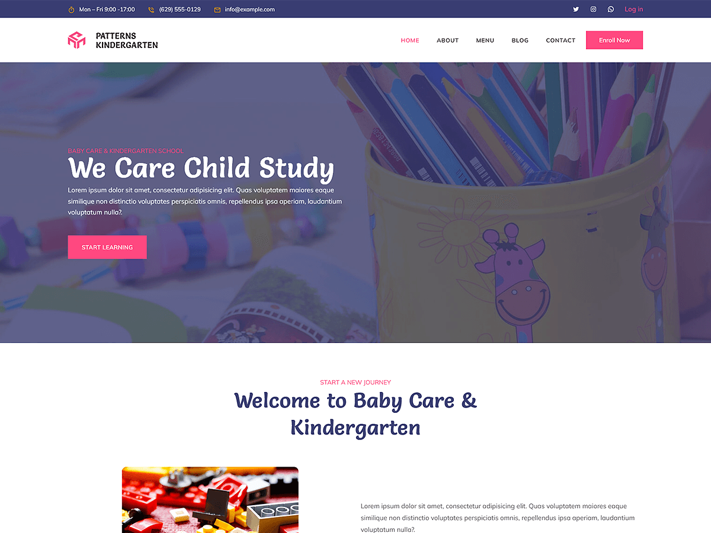

# Patterns Kindergarten

Patterns Kindergarten is a colorful and engaging WordPress theme designed for kindergartens, preschools, daycare centers, and child-focused organizations. Built with WordPress Full Site Editing (FSE), this theme allows effortless customization of headers, footers, templates, and global styles directly within the WordPress Site Editor. The theme includes pre-designed patterns and layouts crafted for showcasing educational programs, services, testimonials, FAQ, facilities, contact pages, about pages, staff, and activities. Its responsive design ensures that your website looks vibrant and functional across all devices, providing a welcoming platform for connecting with parents and the community.

Primary color: `#ff4880`.



## Features

- 3 hero and landing patterns
- 4 card layouts (card-1 through card-4)
- 1 service section pattern
- 5 archive/post-listing patterns
- Contact page pattern (page-contact)
- 1 menu navigation pattern
- 16 section layout patterns (featured sections and section titles)
- Full Site Editing (FSE) support
- Responsive design
- 67 block patterns + 15 templates + 11 template parts
- Kindergarten-oriented layouts (programs, activities, enrollment)

## Requirements

- WordPress 6.6 or higher
- PHP 7.0 or higher
- Tested up to WordPress 6.7

## Development

This theme uses `@wordpress/scripts`:

```sh
npm install
npm run start    # dev mode with watch
npm run build    # production build
```

## License

GNU General Public License v2 or later.

This theme is based on [WP Block Theme Boilerplate](https://github.com/codersantosh/wp-block-theme-boilerplate), (C) 2025 Santosh Kunwar, [GPLv2 or later](https://www.gnu.org/licenses/gpl-2.0.html).
